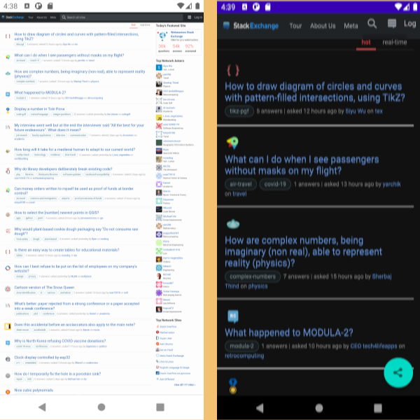

Pancakes
========

Android app to load StackExchange's Hot Questions page in a mobile-friendly view.

This is done by loading the page in the app and injecting JavaScript to
make the website more mobile friendly.

The app also stores StackExchange questions that are visited. On a long press,
it will show a table with all the questions that were visited.

Here are two screenshots that show the difference. The website is loaded
in a mobile browser on the left. On the right is the app that
shows the same website but with far more legible content size.

